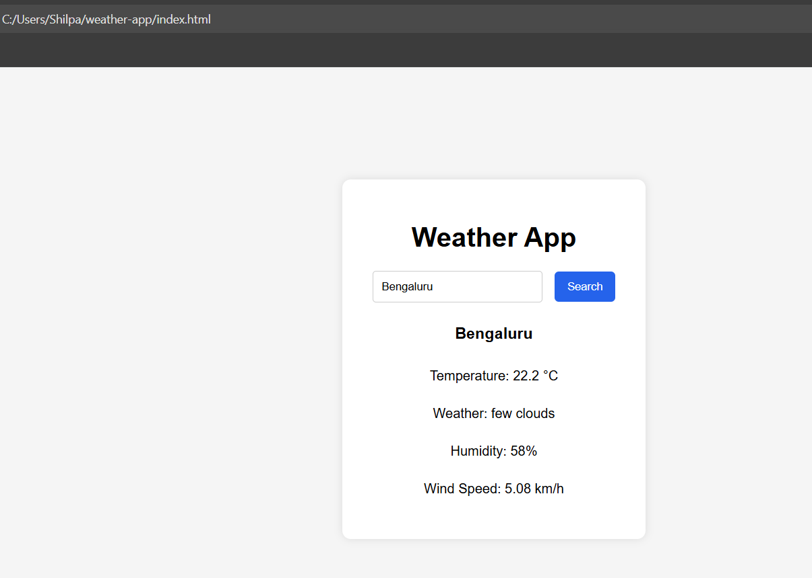
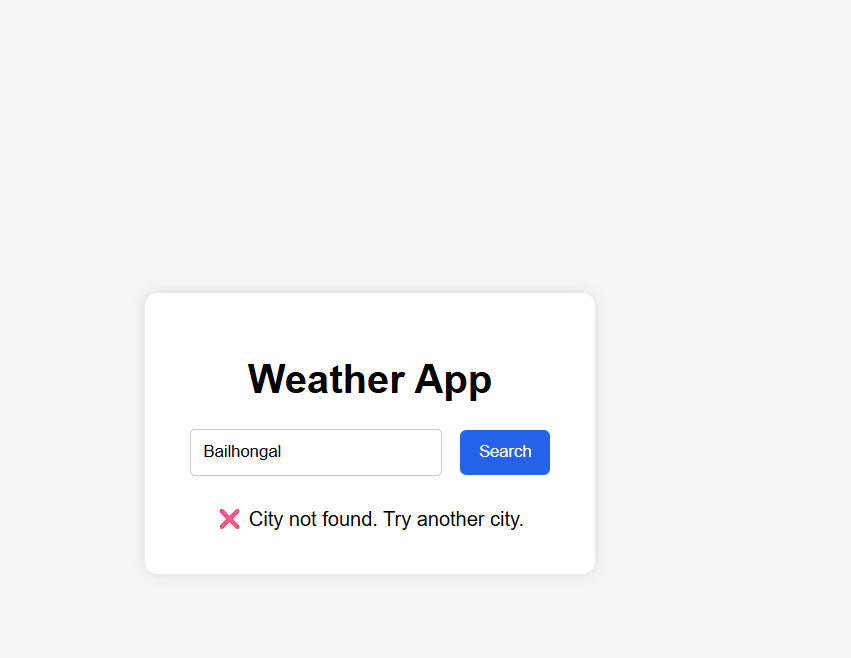
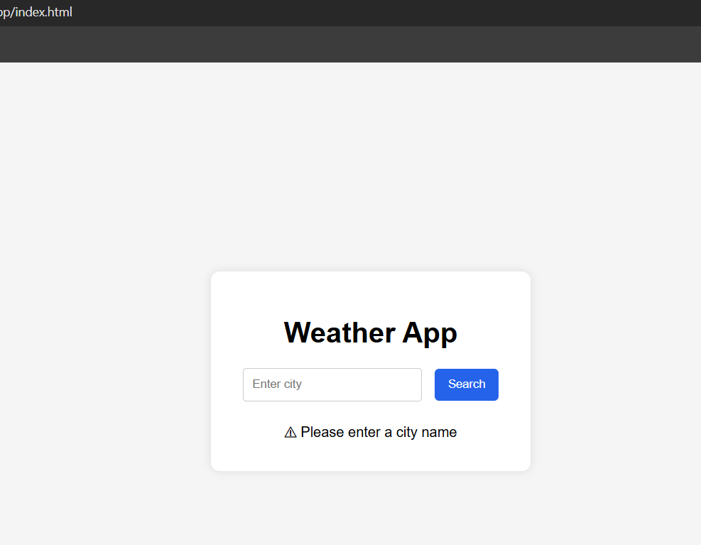

# Weather App

A simple Weather App built using **HTML, CSS, and JavaScript** that fetches real-time weather data using the **OpenWeatherMap API**.

## Features

- Search weather by city
- Displays temperature, humidity, wind speed
- Shows weather condition
- Input validation
- Error handling for invalid cities

## Technologies Used

- HTML5
- CSS3
- JavaScript
- OpenWeatherMap API

## Screenshots

### Weather App Interface

### Weather Result

### Another City Search

